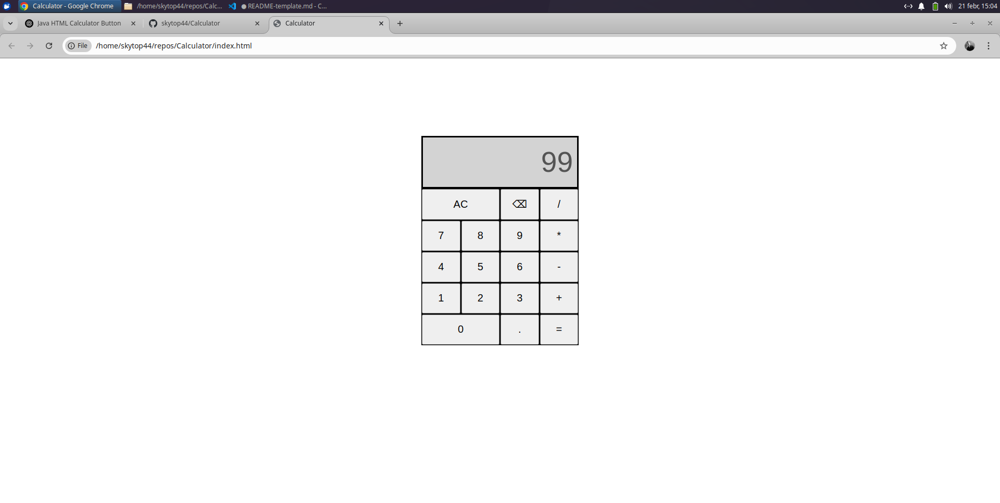

## Table of contents

- [Overview](#overview)
  - [The challenge](#the-challenge)
  - [Screenshot](#screenshot)
- [My process](#my-process)
  - [Built with](#built-with)
- [Author](#author)

## Overview

### The challenge

Build an on-screen calculator.

- build own functions instead of eval()
- add
- subtract
- multiply
- divide
- clear
- backspace
- decimal

Calculator should not evaluate more than a single pair of numbers at a time.

### Screenshot

### Links

- Solution URL: [Link](https://github.com/skytop44/Calculator)
- Live Site URL: [Link](http://skytop44.github.io/Calculator)

## My process

### Built with

- Semantic HTML5 markup
- CSS custom properties
- Flexbox
- CSS Grid
- Javascript

## Author

- Website - [Gyorgy Papp](https://github.com/skytop44/)

